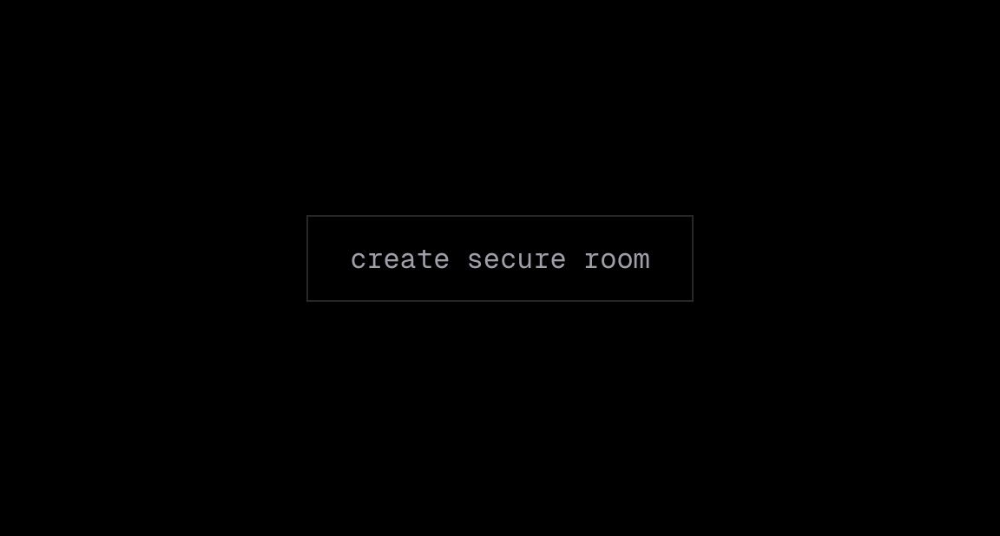
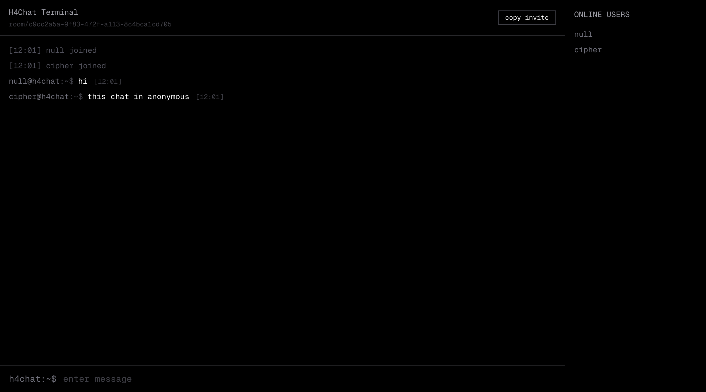

Anonymous Chat Application

This is a simple anonymous chat application where users can communicate privately without revealing their identities.

Features
=> Anonymous usernames
=> Private chat rooms
=> No chat history stored
=> All chat data is deleted after the conversation ends
=> Easy room sharing using links

How It Works
1. Create a Room
Create a new chat room to start a conversation.

2. Share the Link

Copy the generated room link and send it to another user.

3. Start Chatting

Once the other user joins using the link, you can chat anonymously in real time.